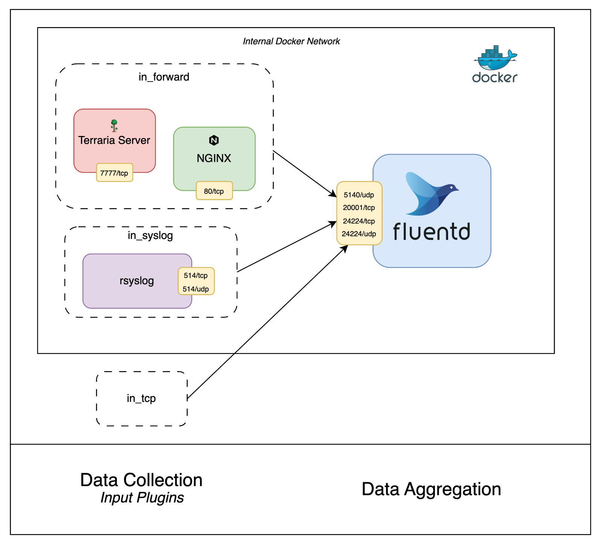

# Get Started with Fluentd in Docker🐳

## Table of Contents
- [Environment](#environment)
    - [Setup](#setup)
    - [Diagram](#diagram)

## Environment

### Setup

```bash
$ docker-compose up --build --detach
```

### Diagram



> The diagram above shows the environment's setup